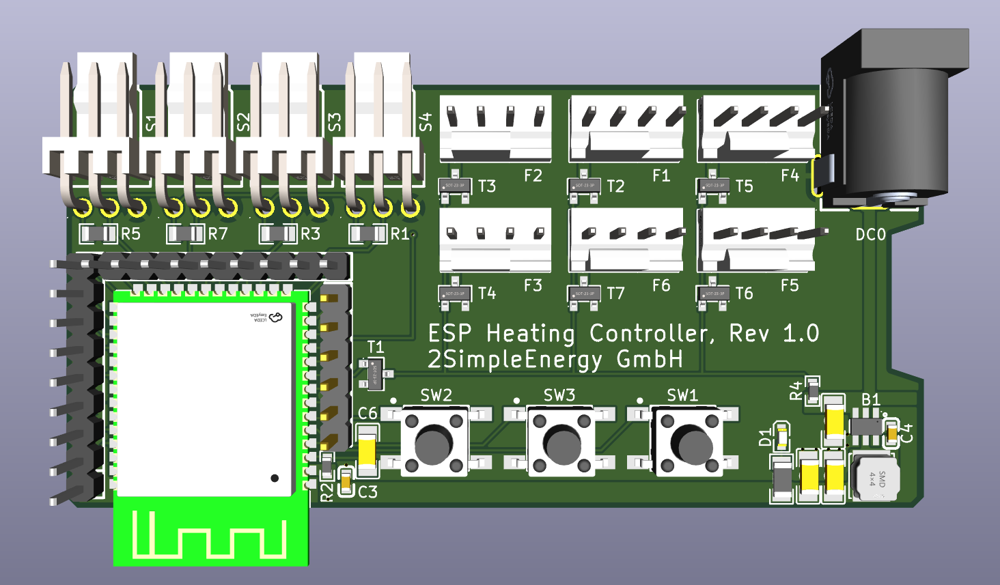

# Heating Fan Controller

A temperature-controlled fan system for improving radiator efficiency through forced convection.

## Overview

This project provides an automated control system for heating radiator fans. By using forced convection, it significantly improves the heat output and efficiency of traditional radiators, especially at lower flow temperatures. This is particularly beneficial for heat pump systems that operate more efficiently at lower temperatures.

## Features

- **Temperature-Based Control**: Automatically activates fans based on radiator temperature
- **PWM Fan Control**: Smooth and quiet fan speed regulation
- **Efficient Heat Distribution**: Improves radiator efficiency and room heating
- **Low Noise Operation**: Designed for quiet residential use

## Why Use Radiator Fans?

Classical radiators typically require high flow temperatures to effectively heat a room. Adding forced convection with PC fans can:

- Significantly enhance radiator efficiency at low flow temperatures
- Enable heat pumps to operate at optimal (lower) temperatures
- Reduce heating costs while maintaining comfort
- Improve heat distribution in the room

### Advanced Monitoring and Control

With four temperature sensors, this controller provides comprehensive monitoring of the entire heating cycle:

- **Flow/Return Temperature Monitoring**: Track the temperature difference across the radiator to measure heat transfer efficiency
- **Air Temperature Delta**: Measure the temperature increase from inlet (bottom) to outlet (top) to quantify the actual heating effect
- **Performance Optimization**: Automatically adjust fan speed based on the temperature differentials to maximize efficiency
- **System Diagnostics**: Identify issues like poor circulation, air locks, or insufficient flow temperatures
- **Energy Efficiency**: Calculate the actual heat output and optimize fan operation to minimize electricity consumption while maximizing heat distribution

## Hardware Components

### Required Components
- **ESP Heating Controller PCB** (Rev 1.0 - design files in `/PCB` folder)
  - PCBs available from maintainer (contact via PM)
  - [3D-printable housing available on Thingiverse](https://www.thingiverse.com/thing:7254499)
- Temperature sensors: DS18B20 (up to 4 sensors supported)
- **12V PC fans** - Both 3-pin and 4-pin fans  up to 6 fans total
  - 3-pin fans: Standard DC voltage control
  - 4-pin PWM fans: Precise PWM speed control (recommended for quieter operation)
  - Note: All fans operate at the same speed (shared PWM signal)
- 12V power supply 
- **[3D-printed mounting clips](https://www.thingiverse.com/thing:5943925)** for attaching fans to radiators 

### Recommended Fans
High-quality PC fans operating at low speeds (<500 RPM) are essentially inaudible while providing significant heat output improvement. The controller supports both 3-pin and 4-pin fans.

## PCB Design


*ESP Heating Controller Rev 1.0 by 2SimpleEnergy GmbH*

The `/PCB` folder contains the custom PCB design files for this project. 

### Hardware Specifications

**Microcontroller:**
- ESP32-WROOM module (WiFi/Bluetooth enabled)
- Enables smart home integration and remote monitoring

**Fan Outputs:**
- **6 fan output channels** (F1-F6)
- **All channels share the same PWM control signal** - fans operate synchronously at the same speed
- Supports multiple fans or fan groups connected across the 6 outputs
- **Compatible with both 3-pin and 4-pin PC fans:**
  - **3-pin fans**: Standard DC voltage control (full voltage = full speed)
  - **4-pin PWM fans**: Advanced PWM control with tachometer feedback for precise speed regulation and RPM monitoring
- Standard 4-pin fan connectors for easy plug-and-play installation

**Temperature Sensor Inputs:**
- **3 Pin Connector ** (S1-S4) for DS18B20 or similar sensors
- Designed for comprehensive heating system monitoring:
  - **Flow temperature**: Monitor water entering the radiator
  - **Return flow temperature**: Monitor water leaving the radiator
  - **Air inlet temperature**: Measure air temperature at bottom of radiator (before heating)
  - **Air outlet temperature**: Measure air temperature at top of radiator (after heating)
- Pull-up resistors (R1, R3, R5, R7) integrated on board
- Enables precise control based on actual radiator performance and efficiency calculations

**User Interface:**
- 3 tactile buttons (SW1, SW2, SW3) for manual control and configuration
- Status LED indicators

**Power Supply:**
- DC barrel jack connector (DC0) for 12V input
- Onboard voltage regulation for ESP32 (3.3V)

**PCB Housing:**
A 3D-printable housing for this PCB is available on Thingiverse for protection and professional mounting:
👉 **[ESP Heating Controller PCB Housing](https://www.thingiverse.com/thing:7254499)**

**PCB Availability:**
I have some leftover PCBs ! If you're interested in procuring a board instead of manufacturing it yourself, please contact me via private message on GitHub.

## Installation

### Hardware Setup

1. **3D-print the components**:
   - Download and print the **[PCB housing](https://www.thingiverse.com/thing:7254499)** for the controller
   - Download and print the **[fan mounting clips](https://www.thingiverse.com/thing:5943925)** (2 clips per fan)
2. **Assemble the controller**:
   - Install the ESP Heating Controller PCB into the housing
   - Mount the housing to wall or heating
3. **Prepare the fans**: Mount the PC fans using the printed clips below your radiators
   - Insert clips from below between the radiator ribs
   - Ensure secure fit (designed for 75mm inner distance, adjustable)
   - Use cable ties through the eyelets for cable management
3. **Wire the temperature sensor**: Connect DS18B20 to the controller
   - Red: +3.3V 
   - Yellow/Data: Data line (with 4.7kΩ pull-up resistor)
   - Black: GND
3. **Connect the fans**: Wire fans to the controller output
4. **Power supply**: Connect 12V power supply

### Software Setup

1. Clone this repository:
```bash
git clone https://github.com/Radioaktivman/Heating-Fan-Controller.git
cd Heating-Fan-Controller
```

2. **Firmware Option: Tasmota**

This controller uses Tasmota firmware for easy configuration and smart home integration.

**Step-by-Step Tasmota Configuration:**

**Step 1: Flash Tasmota Firmware**
1. Flash Tasmota firmware to the ESP32 module using your preferred method (web flasher, esptool, etc.)
2. Select ESP32 variant during flashing

**Step 2: Initial WiFi Setup**
1. Power on the device - it will create a WiFi access point named "tasmota-XXXXXX"
2. Connect to this access point with your phone/computer
3. Configure your WiFi credentials:
   - SSID: YourNetworkName
   - Password: [Your WiFi Password]
4. The device will restart and connect to your network

**Step 3: Access Tasmota Web Interface**
1. Find the device's IP address (check your router or use Tasmota discovery)
2. Open a web browser and navigate to the IP address
3. You should see the Tasmota web interface

**Step 4: Configure Module Type**
1. Go to **Configuration** → **Configure Module**
2. Set **Module type** to **ESP32S3 (1)**
3. Click **Save** - the device will restart

**Step 5: Configure GPIO Pins**
After restart, go back to **Configuration** → **Configure Module** and set the following GPIO pins:

| GPIO Pin | Function | Number |
|----------|----------|--------|
| GPIO03 | DS18x20 | 4 |
| GPIO04 | Button | 1 |
| GPIO05 | Button | 2 |
| GPIO06 | Button | 3 |
| GPIO11 | DS18x20 | 3 |
| GPIO14 | DS18x20 | 2 |
| GPIO16 | Relay_i | 1 |
| GPIO18 | PWM | 1 |
| GPIO48 | DS18x20 | 1 |

Leave all other GPIO pins set to **None**.

Click **Save** - the device will restart again.

**Step 6: Configure Temperature Sensor Names**
1. Go to **Console**
2. Enter the following commands to name your DS18B20 sensors:
```
Backlog DS18Alias 1,Flow; DS18Alias 2,Return; DS18Alias 3,AirIn; DS18Alias 4,AirOut
```

**Step 7: Configure Control Rules**
The three buttons provide manual control for the fan system. Configure the automation rules:

1. Go to **Console**
2. Enable Rule1:
```
Rule1 1
```
3. Configure Rule1 with the following logic:
```
Rule1 
ON Button3#state DO Dimmer + ENDON 
ON Button2#state DO Dimmer - ENDON 
ON Button1#state DO power1 toggle ENDON 
ON Dimmer#state >= 100 DO power1 off ENDON 
ON Dimmer#state < 80 DO power1 on ENDON
```

**Button Functions:**
- **Button 1 (GPIO04)**: Toggle fan power on/off
- **Button 2 (GPIO05)**: Decrease fan speed (Dimmer -)
- **Button 3 (GPIO06)**: Increase fan speed (Dimmer +)
- **Auto-control**: 
  - Fans turn OFF when dimmer reaches 100%
  - Fans turn ON when dimmer drops below 80%

**Step 8: Configure MQTT (Optional, for Home Assistant)**
1. Go to **Configuration** → **Configure MQTT**
2. Enter your MQTT broker details:
   - Host: [Your MQTT broker IP]
   - Port: 1883 (default)
   - Client: heating_controller_%06X
   - User: [Your MQTT username]
   - Password: [Your MQTT password]
   - Topic: heating_controller
3. Click **Save**

**Step 9: Test Your Setup**
1. Check that all four temperature sensors appear in the main interface
2. Test the three buttons for manual control
3. Verify PWM control is working by adjusting the dimmer
4. Monitor MQTT messages if configured

Your ESP Heating Controller is now fully configured and ready to use!

## Contributing

Contributions are welcome! Please feel free to submit a Pull Request or open an Issue for bugs, suggestions, or improvements.

## License

This project is licensed under the MIT License - see the [LICENSE](LICENSE) file for details.

## Acknowledgments

Inspired by similar projects in the home automation community focused on improving heating efficiency and reducing energy costs.

## Roadmap / TODO

### Upcoming Features

- **Thermostat Control Unit**: A thermostat control module will be added in the next update to gain full control of the heating system. This will enable:
  - Complete closed-loop heating control
  - Automatic heating system regulation based on flor and/or air temperature
  - Enhanced energy efficiency through intelligent heating management


## Contact

Project maintained by [@Radioaktivman](https://github.com/Radioaktivman)

Project Link: [https://github.com/Radioaktivman/Heating-Fan-Controller](https://github.com/Radioaktivman/Heating-Fan-Controller)

---

**Note**: This is an early-stage project. Documentation and features will be expanded as development continues.
